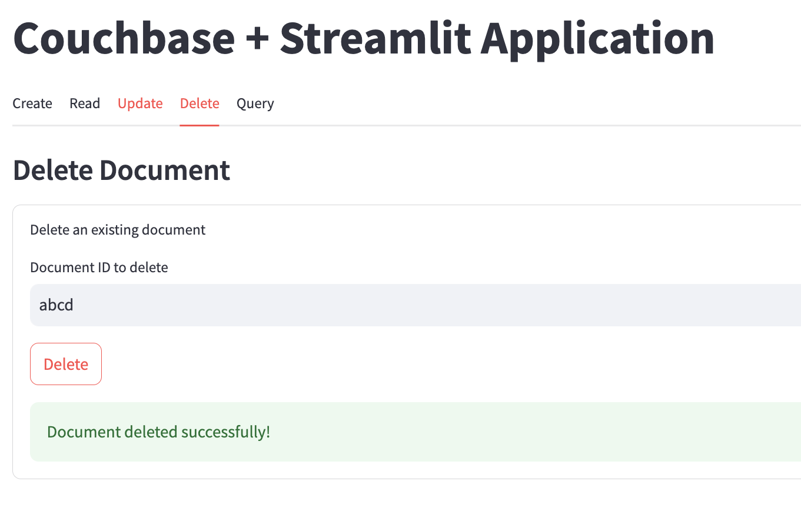

# Getting Started with the Couchbase-Streamlit Connector

## Introduction

The [Couchbase-Streamlit Connector](https://github.com/Couchbase-Ecosystem/couchbase-streamlit-connector) provides a seamless way to integrate Couchbase with Streamlit applications. This connector simplifies database operations, allowing developers to interact with Couchbase clusters directly within Streamlit without requiring extensive SDK knowledge.

This quickstart tutorial will guide you through building a basic Streamlit application with Couchbase, covering fundamental **CRUD** (Create, Read, Update, Delete) and **Query** operations. If you want to see the simple app built in this tutorial, check it out [here](https://couchbase-st-tutorial.streamlit.app/). The whole code for this tutorial is available [here](https://github.com/couchbase-examples/streamlit-quickstart/blob/main/Home.py).

If you're looking for a more comprehensive application with advanced functionalities, refer to [this tutorial](https://developer.couchbase.com/tutorial-couchbase-streamlit-connector), which builds the [Couchbase Connector Demo App](https://couchbase-connector-demo-app.streamlit.app/).


## Features

- **Seamless Connection Handling**: Establishes a Couchbase cluster connection via environment variables or manual parameters.
- **CRUD Operations**: Supports inserting, retrieving, updating, and deleting documents from Couchbase collections.
- **Dynamic Collection Switching**: Allows setting and switching between different Couchbase buckets, scopes, and collections.
- **Efficient Query Execution**: Runs N1QL (SQL++) queries directly within Streamlit.
- **Exception Handling**: Provides meaningful error messages for authentication failures, timeouts, and other Couchbase-related issues.
- **Streamlit Integration**: Works as a `BaseConnection` class, making it compatible with Streamlit’s `st.connection()` API.


## Running the Demo Applications

You can run both the **Quickstart Demo** and the **Comprehensive Demo** locally by following these steps:


### Initialization

```sh
# Clone the repository
git clone https://github.com/couchbase-examples/streamlit-quickstart.git
cd streamlit-quickstart

# Python Virtual Environment
python -m venv venv
source venv/bin/activate  # On Windows: venv\Scripts\activate

# Install dependencies
pip install -r requirements.txt
```

### Running the Quickstart Demo (Basic CRUD App)

```sh
# Run the application
streamlit run Home.py
```

<div style="text-align: center;">
    
</div>

### Running the Comprehensive Demo (Advanced Features)

```sh
# Run the application
streamlit run Demo.py
```

<div style="text-align: center;">
    
</div>

For a detailed explanation of how these applications work, refer to the [official tutorial](https://github.com/couchbase-examples/couchbase-tutorials/tree/main/tutorial/markdown/python/streamlit).


## Creating the Basic CRUD Application Step-by-Step

This section outlines the step-by-step process of building the Streamlit application that integrates with Couchbase for retrieving and inserting data.

### Prerequisites
Before setting up the environment, ensure you have the following:

- **Python 3.10 or higher** ([Check compatibility](https://docs.couchbase.com/python-sdk/current/project-docs/compatibility.html#python-version-compat))
- **Couchbase Capella account** ([Setup Guide](https://docs.couchbase.com/cloud/get-started/intro.html))
- **Operational Couchbase cluster** with configured access ([Instructions](https://docs.couchbase.com/cloud/get-started/connect.html#prerequisites))
- **Connection string** from Couchbase Capella

### Installation and Setup
Create an isolated Python environment, run the following commands:

```sh
python -m venv venv
source venv/bin/activate  # On Windows: venv\Scripts\activate
```
Install the required libraries for this project:
```sh
pip install couchbase-streamlit-connector
```
Run the following command to check if Streamlit is installed correctly:
```sh
streamlit hello
```

If everything is set up correctly, a browser window should open with Streamlit's demo application.

### Implementing Function to make a Connection

Create a new file `app.py`:

Main function:
```python
connection = st.connection(
    "couchbase",  # Connection alias
    type=CouchbaseConnector,  # Specify the Couchbase connector type
    CONNSTR=conn_str,  # Connection string
    USERNAME=username,  # Username for authentication
    PASSWORD=password,  # Password for authentication
    BUCKET_NAME=bucket_name,  # Name of the target bucket
    SCOPE_NAME=scope_name,  # Name of the target scope
    COLLECTION_NAME=collection_name  # Name of the target collection
)
```
In Context:
```python
import streamlit as st
import json
from couchbase_streamlit_connector.connector import CouchbaseConnector

def initialize_connection():
    # Set the application title
    st.title("Couchbase + Streamlit Application")
    
    # Sidebar for connection settings
    with st.sidebar:
        st.header("Connection Settings") # Sidebar header for clarity

        # User input fields for Couchbase connection parameters
        conn_str = st.text_input("Connection String")  # Connection string for Couchbase
        username = st.text_input("Username")  # Username for authentication
        password = st.text_input("Password", type="password")  # Password (masked for security)
        bucket_name = st.text_input("Bucket Name")  # Couchbase bucket to connect to
        scope_name = st.text_input("Scope Name")  # Scope within the bucket
        collection_name = st.text_input("Collection Name")  # Collection within the scope
        
        # Button to establish a connection
        if st.button("Connect", key="connect_btn"):
            try:
                # Attempt to create a connection using the provided details
                connection = st.connection(
                    "couchbase",  # Connection alias
                    type=CouchbaseConnector,  # Specify the Couchbase connector type
                    CONNSTR=conn_str,  # Connection string
                    USERNAME=username,  # Username for authentication
                    PASSWORD=password,  # Password for authentication
                    BUCKET_NAME=bucket_name,  # Name of the target bucket
                    SCOPE_NAME=scope_name,  # Name of the target scope
                    COLLECTION_NAME=collection_name  # Name of the target collection
                )

                # Store the connection in session state for later use
                st.session_state["connection"] = connection  
                
                # Display success message if connection is successful
                st.success("Connected successfully!")
            except Exception as e:
                # Display an error message if connection fails
                st.error(f"Connection failed: {e}")
```
This Streamlit app provides a simple user interface to connect to a Couchbase database. Users enter connection details (such as the connection string, credentials, and collection details) in the sidebar, and clicking the "Connect" button attempts to establish a connection using CouchbaseConnector. If successful, a success message is displayed, and the connection is stored in the session state. If the connection fails, an error message is shown.

### Implementing CRUD Operations

#### Create Operation

Main function:
```python
st.session_state["connection"].insert_document(doc_id, json_data)
```
In Context:
```python
def insert_document():
    st.subheader("Create Document")  # Section header for inserting a document

    # Expander widget to collapse/expand the document insertion panel
    with st.expander("Insert a new document", expanded=False):
        # Input field for Document ID (unique identifier for the document)
        doc_id = st.text_input("Document ID", key="create_id")

        # Multi-line text area for entering document data in JSON format
        doc_data = st.text_area(
            "Document Data (JSON)",
            value='{\n  "name": "John Doe",\n  "email": "john@example.com"\n}',  # Pre-filled example JSON
            key="create_data"
        )

        # Button to insert the document
        if st.button("Insert", key="create_btn"):
            try:
                # Convert input JSON string to a Python dictionary safely
                json_data = json.loads(doc_data)  # Using json.loads() instead of eval() to prevent security risks

                # Insert the document into Couchbase using the active connection
                st.session_state["connection"].insert_document(doc_id, json_data)

                # Display success message upon successful insertion
                st.success("Document inserted successfully!")
            except Exception as e:
                # Display error message if insertion fails
                st.error(f"Insert failed: {e}")

```
This function allows users to create and insert a new document into a Couchbase collection through a Streamlit interface. Users provide a Document ID and JSON-formatted data, which is then inserted when they click the "Insert" button. The function ensures safe JSON parsing using json.loads() instead of eval(), preventing potential security risks like code injection. If the insertion is successful, a success message is displayed; otherwise, an error message appears.

#### Read Operation
Main function:
```python
doc = st.session_state["connection"].get_document(doc_id)
```
In Context:
```python
def fetch_document():
    st.subheader("Read Document")  # Section header for fetching a document

    # Expander widget to optionally collapse/expand the fetch panel
    with st.expander("Fetch an existing document", expanded=False):
        # Input field for the Document ID to retrieve
        doc_id = st.text_input("Document ID to fetch", key="read_id")

        # Button to trigger document retrieval
        if st.button("Fetch", key="read_btn"):
            try:
                # Fetch the document from Couchbase using the provided ID
                doc = st.session_state["connection"].get_document(doc_id)

                # Display the retrieved document in JSON format for easy reading
                st.json(doc)
            except Exception as e:
                # Show an error message if fetching fails (e.g., document not found, connection issue)
                st.error(f"Fetch failed: {e}")

```
This function allows users to retrieve a document from Couchbase by entering its Document ID. When the "Fetch" button is clicked, it queries the database and displays the document's contents in a structured JSON format. If the document is not found or there's a connection issue, an error message is shown.

#### Update Operation
Main function:
```python
st.session_state["connection"].replace_document(doc_id, json_data)
```
In Context:
```python
def update_document():
    st.subheader("Update Document")  # Section header for updating a document

    # Expander widget to optionally collapse/expand the update panel
    with st.expander("Update an existing document", expanded=False):
        # Input field for the Document ID to update
        doc_id = st.text_input("Document ID to update", key="update_id")

        # Multi-line text area for entering new document data in JSON format
        new_data = st.text_area(
            "Updated Data (JSON)",
            key="update_data",
            value='{\n  "name": "John Doe",\n  "email": "john@example.com"\n}',  # Pre-filled example JSON
        )

        # Button to update the document
        if st.button("Update", key="update_btn"):
            try:
                # Convert input JSON string to a Python dictionary safely
                json_data = json.loads(new_data)  # Using json.loads() instead of eval() for security

                # Replace the existing document with new data
                st.session_state["connection"].replace_document(doc_id, json_data)

                # Display success message upon successful update
                st.success("Document updated successfully!")
            except Exception as e:
                # Display an error message if the update fails
                st.error(f"Update failed: {e}")
```
This function allows users to update an existing document in Couchbase by providing a Document ID and new JSON data. When the "Update" button is clicked, the document's content is entirely replaced with the new data. The function ensures safe JSON parsing using json.loads() to prevent security risks. If the update is successful, a success message is displayed; otherwise, an error message appears.

#### Delete Operation
Main function:
```python
st.session_state["connection"].remove_document(doc_id)
```
In Context:
```python
def delete_document():
    st.subheader("Delete Document")  # Section header for deleting a document

    # Expander widget to optionally collapse/expand the delete panel
    with st.expander("Delete an existing document", expanded=False):
        # Input field for the Document ID to delete
        doc_id = st.text_input("Document ID to delete", key="delete_id")

        # Button to trigger document deletion
        if st.button("Delete", key="delete_btn"):
            try:
                # Remove the document from Couchbase using the provided ID
                st.session_state["connection"].remove_document(doc_id)

                # Display success message upon successful deletion
                st.success("Document deleted successfully!")
            except Exception as e:
                # Show an error message if deletion fails (e.g., document not found, connection issue)
                st.error(f"Delete failed: {e}")

```
This function allows users to delete an existing document from Couchbase by specifying its Document ID. When the "Delete" button is clicked, the document is removed from the database. The function provides immediate feedback, displaying a success message if the deletion is successful or an error message if the document does not exist or there is a connection issue.

### Implement Function for Querying Data
Main function:
```python
results = st.session_state["connection"].query(query)
data = []
for row in results:
    data.append(row)
```
In Context:
```python
def query_data():
    st.subheader("Query Data")  # Section header for executing queries

    # Expander widget to collapse/expand the query execution panel
    with st.expander("Execute SQL++ Query", expanded=False):
        # Multi-line text area for entering a SQL++ (N1QL) query
        query = st.text_area(
            "SQL++ Query",
            value="SELECT * FROM `travel-sample`.inventory.airline LIMIT 5;",  # Pre-filled example query
            key="query_input"
        )

        # Button to execute the query
        if st.button("Execute Query", key="query_btn"):
            try:
                # Execute the SQL++ query using the active Couchbase connection
                results = st.session_state["connection"].query(query)

                # Convert query results from an iterator to a list for display
                data = []
                for row in results:
                    data.append(row)

                # Display query results in Streamlit
                st.write(data)
            except Exception as e:
                # Show an error message if the query execution fails
                st.error(f"Query failed: {e}")

```
This function enables users to execute SQL++ (N1QL) queries against Couchbase and view the results in a Streamlit interface. Users enter a query in the text area and click the "Execute Query" button to retrieve data. The query results are processed using a for row in results loop, which converts the iterator into a list, ensuring that all results are displayed at once while optimizing memory usage. If the query execution fails, an error message is displayed.

### Implementing Main function
```python
def main():
    # Initialize the Couchbase connection settings in the sidebar
    initialize_connection()
    
    # Check if a connection is successfully established
    if "connection" in st.session_state:
        # Create tabbed navigation for different database operations
        tab1, tab2, tab3, tab4, tab5 = st.tabs([
            "Create", "Read", "Update", "Delete", "Query"
        ])

        # Assign each tab to its respective function
        with tab1:
            insert_document()  # Tab for inserting new documents
        with tab2:
            fetch_document()  # Tab for reading (fetching) documents
        with tab3:
            update_document()  # Tab for updating existing documents
        with tab4:
            delete_document()  # Tab for deleting documents
        with tab5:
            query_data()  # Tab for executing SQL++ queries
    else:
        # Display an informational message if no connection is found
        st.info("Please connect to Couchbase using the sidebar to start.")

# Run the Streamlit application
if __name__ == "__main__":
    # Set up the page configuration (title, icon, layout)
    st.set_page_config(
        page_title="Couchbase Streamlit Demo",  # Title of the web app
        page_icon="🔌",  # Page icon (plugin symbol)
        layout="wide"  # Use a wide layout for better visibility
    )
    
    # Call the main function to start the app
    main()

```
This script serves as the main entry point for the Streamlit application, handling user interaction and connecting to Couchbase. It first initializes the Couchbase connection settings in the sidebar and then provides a tabbed interface for performing CRUD (Create, Read, Update, Delete) operations along with executing SQL++ queries. If the user has not connected to Couchbase, an info message prompts them to do so.


## Running Your Application

1. **Start the Streamlit application**:
   ```bash
   streamlit run app.py
   ```

2. **Access the application**:
   - Open your browser to `http://localhost:8501`
   - Enter your Couchbase connection details
   - Start interacting with your data

3. **Screenshots of the Steps**

- Entering Couchbase Connection Details

<div style="text-align: center;">
    
</div>


- Performing CRUD Operations
<table style="margin: auto; text-align: center; border-spacing: 2vw;">
  <tr>
    <td></td>
    <td></td>
  </tr>
  <tr>
    <td></td>
    <td></td>
  </tr>
</table>

- Running a Query

<div style="text-align: center;">
    
</div>

## Conclusion

The [Couchbase-Streamlit Connector](https://github.com/Couchbase-Ecosystem/couchbase-streamlit-connector) simplifies the integration of Couchbase with Streamlit, enabling seamless database interactions within Streamlit applications. With built-in support for CRUD operations, dynamic collection switching, and efficient query execution, this connector reduces development overhead while enhancing productivity. 

By leveraging this connector, developers can focus on building interactive applications without worrying about complex database connections or SDK configurations. Whether you're managing real-time data, performing analytics, or handling structured documents, this tool provides a reliable and efficient way to work with Couchbase in Streamlit.

## Appendix

Here are some helpful resources for working with Couchbase and Streamlit:

### **Couchbase Documentation**
- [Couchbase Python SDK Compatibility](https://docs.couchbase.com/python-sdk/current/project-docs/compatibility.html#python-version-compat)  
- [Getting Started with Couchbase Capella](https://docs.couchbase.com/cloud/get-started/intro.html)  
- [Connecting to Couchbase Capella](https://docs.couchbase.com/cloud/get-started/connect.html#prerequisites)  
- [N1QL Query Language Guide](https://docs.couchbase.com/server/current/n1ql/n1ql-language-reference/index.html)  
- [Couchbase SDKs Overview](https://docs.couchbase.com/home/sdk.html)  

### **Streamlit Documentation**
- [Streamlit Secrets Management](https://docs.streamlit.io/develop/concepts/connections/secrets-management)  
- [Using `st.connection`](https://docs.streamlit.io/develop/api-reference/connections)  
- [Streamlit Components](https://docs.streamlit.io/develop/api-reference)  
